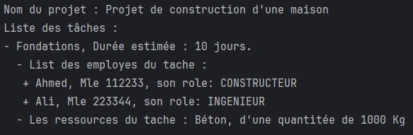

# Gestionnaire de Projets de Construction 🏗️

Ce gestionnaire de projets de construction est conçu pour aider à organiser les tâches, les employés et les ressources matérielles dans un projet de construction.

## Structure du Projet

Le projet est organisé en classes Java, avec les rôles suivants :

- `Projet`: Représente un projet de construction avec un nom et une liste de tâches.
- `Tache`: Représente une tâche dans un projet, avec un nom, une durée estimée, une liste d'employés assignés et une liste de ressources matérielles nécessaires.
- `Employe`: Représente un employé avec des informations personnelles telles que le nom, le salaire, le numéro de matricule, l'âge, l'email et le numéro de téléphone, ainsi que le rôle dans le projet.
- `RessourceMaterielle`: Représente une ressource matérielle nécessaire à une tâche.
- `Role`: Enumération des divers rôles qu'un employé peut avoir.
- `Personne`: Classe de base représentant une personne avec des informations telles que le nom, le salaire, le numéro de matricule, l'âge, l'email et le numéro de téléphone.

## Exécution du Programme

Pour exécuter le programme, vous pouvez utiliser la classe `Main`. Elle crée un projet, ajoute des tâches, des employés et des ressources, puis affiche les informations du projet.

## Capture d'Écran de l'execution de la classe `Main`

N'hésitez pas à explorer le code pour plus de détails sur l'implémentation.
